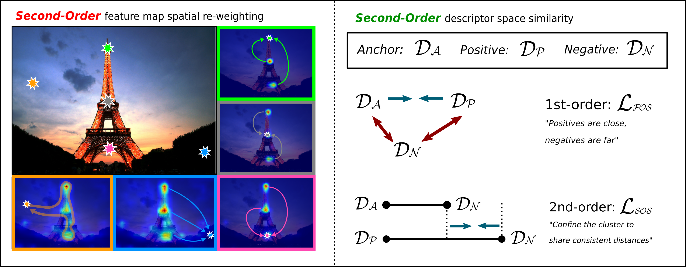
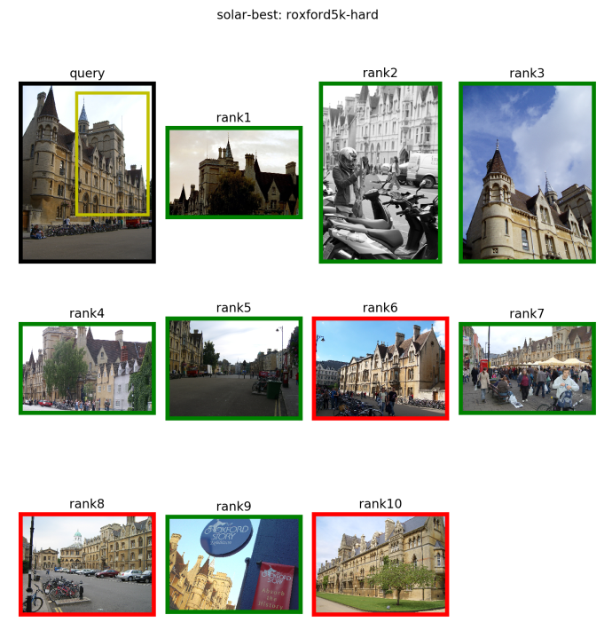
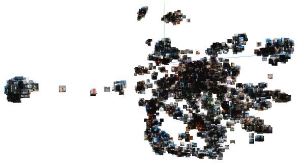
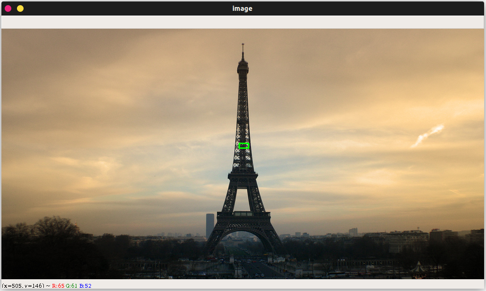
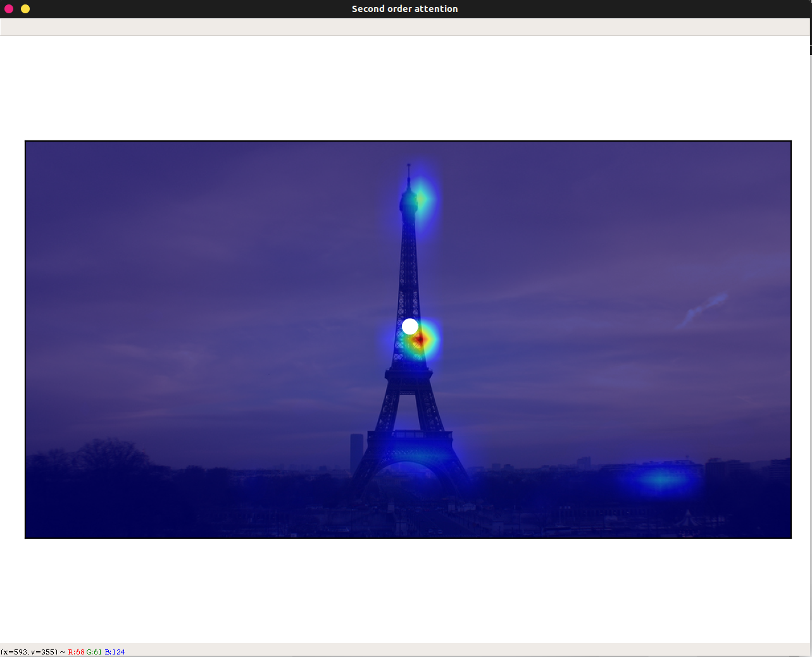
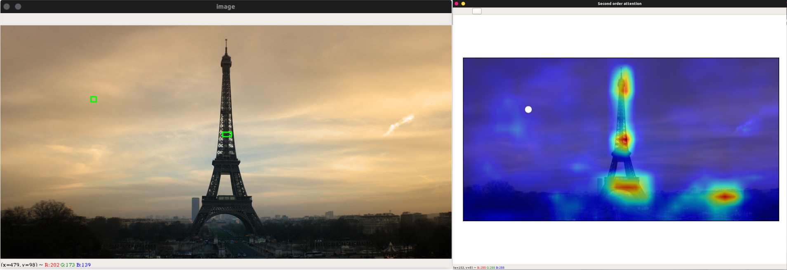

# SOLAR: Second-Order Loss and Attention for Image Retrieval


This repository contains the PyTorch implementation of our paper:

**"SOLAR: Second-Order Loss and Attention for Image Retrieval"**   
Tony Ng, Vassileios Balntas, Yurun Tian, Krystian Mikolajczyk. ECCV 2020.  
[[arXiv](https://arxiv.org/abs/2001.08972)] [[short video](https://www.youtube.com/watch?v=J1jahze3kds)] [[long video](https://www.youtube.com/watch?v=tfIW0widG9k )] [[ECCV Daily feature article](https://www.rsipvision.com/ECCV2020-Thursday/16/)] [[OpenCV blog](https://opencv.org/utilising-second-order-information-for-deep-image-retrieval/)]



Before going further, please check out [Filip Radenovic's great repository on image retrieval.](https://github.com/filipradenovic/cnnimageretrieval-pytorch) Our `solar-global` module is heavily built upon it. If you use this code in your research, please also cite their work!
[[link to license](https://github.com/filipradenovic/cnnimageretrieval-pytorch/blob/master/LICENSE)]
## Features
- [x] Complete test scripts for large-scale image retrieval with `solar-global`
- [x] Inference code for extracting local descriptors with `solar-local`
- [x] Second-order attention map visualisation for large images
- [x] Image matching visualisation
- [x] Training code for image retrieval

## Requirements
- Python 3
- [PyTorch](https://pytorch.org/get-started/locally/) tested on 1.3.0 - 1.5.1, torchvision 0.5+
- [opencv-python (cv2)](https://pypi.org/project/opencv-python/) tested on 3.3.0.10
- [TensorBoard](https://www.tensorflow.org/tensorboard) tested on 2.0.0+
- numpy
- PIL
- [tqdm](https://github.com/tqdm/tqdm)

## Download model weights and descriptors
Begin with downloading our best models (both global and local) described in the paper, as well as the pre-computed descriptors of the [1M distractors set](https://github.com/filipradenovic/revisitop).

```sh
sh download.sh
```

The global model is saved at `data/networks/resnet101-solar-best.pth` and the local model at `solar_local/weights/local-solar-345-liberty.pth`. The descriptors of the 1M distractors are saved in the main directory (the file is quite big ~8GB, so it might take a while to download).

## Testing our global descriptor
Here you can try out our pretrained model `resnet101-solar-best.pth` on the [Revisiting Oxford and Paris](https://github.com/filipradenovic/revisitop) dataset

<details>
<summary><b>Testing on R-Oxford, R-Paris</b></summary></br>
Once you've successfully downloaded the global model weights, run

```
python3 -m solar_global.examples.test
```

This script automatically downloads [`roxford5k,rparis6k`](http://cmp.felk.cvut.cz/revisitop/data/datasets/) into `data/test/` and evaluates SOLAR on them.
After a while, you should be able to get results as below 
```
>> roxford5k: mAP E: 85.88, M: 69.9, H: 47.91
>> roxford5k: mP@k[1, 5, 10] E: [94.12 92.45 88.8 ], M: [94.29 90.86 86.71], H: [88.57 74.29 63.  ]

>> rparis6k: mAP E: 92.95, M: 81.57, H: 64.45
>> rparis6k: mP@k[1, 5, 10] E: [100.   96.57 95.43], M: [100.   98.   97.14], H: [97.14 94.57 93.  ]
```

Retrieval rankings are visualised in `specs/` using
```sh
tensorboard --logdir specs/ --samples_per_plugin images=1000
```
You can view them on your browser at `localhost:6006` in the `IMAGES` tab. Here's an example



You can also switch to the `PROJECTOR` tab and play around with [TensorBoard's embedding visualisation tool](https://www.tensorflow.org/tensorboard/tensorboard_projector_plugin). Here's an example of the 6322 database images in R-Paris, visualised with [t-SNE](https://lvdmaaten.github.io/tsne/)


</details>

<details>
<summary><b>Testing with the extra 1-million distractors</b></summary></br>

If you decide to extract the descriptors on your own, run 

(**Note: this step takes a lot of time and storage, and we only provide it for verification. You can skip to the next command if you've already downloded the pre-computed descriptors from the previous step!**)
```
python3 -m solar_global.examples.extract_1m
```

This script would download and extract the [1M distractors set](http://ptak.felk.cvut.cz/revisitop/revisitop1m/) and save them into `data/test/revisitop1m/`. This dataset is quite large (400GB+), so depending on your network & GPU, the whole process of downloading + extracting descriptors can take from a couple of days to a week. In our setting (~100MBps, V100), the download + extraction takes ~10 hours and the descriptors ~30 hours to be computed.

Now, make sure that `resnet101-solar-best.pth_vecs_revisitop1m.pt` is in the main directory, whether from the extraction step above or from the download ealier. Then you can run

```
python3 -m solar_global.examples.test_1m
```
and get results as below 
```
>> roxford5k: mAP E: 72.04, M: 53.49, H: 29.89
>> roxford5k: mP@k[1, 5, 10] E: [88.24 81.99 76.96], M: [88.57 82.29 76.71], H: [74.29 58.29 48.86]

>> rparis6k: mAP E: 83.35, M: 59.19, H: 33.41
>> rparis6k: mP@k[1, 5, 10] E: [98.57 95.14 93.57], M: [98.57 96.29 94.86], H: [92.86 89.14 81.57]
```
</details>

## Visualising second-order attention maps

<details>
<summary><b> Using our interactive visualisation tool </b></summary></br>

We provide a small demo for you to click around an image and interactively visualise the second-order attention (SOA) maps at different locations you select. (*c.f.* Section 4.3 in the [paper](https://arxiv.org/pdf/2001.08972.pdf) for an in-depth analysis)

First, run
```
python3 -m demo.interactive_soa
```

This gorgeous image of the Eiffel Tower should pop up in a new window


Try drawing a (light green) rectangle centred at the location you would like to visualise the SOA map



A new window titled `Second order attention` with the SOA from the closest location in the feature map overlaid on the image, and a white dot indicating where you've selected should appear as below



Now, try drawing a rectangle in the sky, you should see the SOA more spread-out and silhouetting the main landmarks like this



You can keep clicking around the image to visualise more SOAs. Remember, the white dot in the SOA map tells you where the currently displayed attention map is selected from!

You can also try out different images by parsing the programme with
```
python3 -m demo.interactive_soa --image PATH/TO/YOUR/IMAGE
```

</details>

<details>
<summary><b> Jupyter-Notebook </b></summary></br>

***Coming Soon!***

</details>

## Testing our local descriptor

<details>
<summary><b> Simple inference </b></summary></br>

We provide a bare-bones inference code for the local counterpart of SOLAR (Section 5.3 in the paper), so you can plug it into whatever applications you have for local descriptors.

To check that it works, run
```
python3 -m solar_local.example
```

If successful, it should display the following message
```
SOLAR_LOCAL - SOSNet w/ SOA layers:
SOA_3:
Num channels:    in   out   mid
                 64    64    16
SOA_4:
Num channels:    in   out   mid
                 64    64    16
SOA_5:
Num channels:    in   out   mid
                128   128    64
Descriptors shape torch.Size([512, 128])
```

</details>

<details>
<summary><b> Jupyter-Notebook </b></summary></br>

Follow [our demo notebook](demo/solar_local_matching.ipynb) to see a comparison between `solar_local` and the baseline [SOSNet](https://github.com/scape-research/SOSNet) on an image-matching toy example.

</details>


## Training SOLAR

<details>
<summary><b>Pre-processing the training set</b></summary></br>

As the [GL18 dataset](https://www.kaggle.com/google/google-landmarks-dataset) consists of only URLs, many of which have already expired, this part of the code lets you download the images we had at the time of training our models. However, this also means that extra storage space would be required for extracting tarballs, so please expect to have ~700GB upwards available. Otherwise, you could still download using [GL18's downloader](https://www.kaggle.com/tobwey/landmark-recognition-challenge-image-downloader) and save the images at `data/train/gl18/jpg`.

To download the images and pre-process them for training, simply run
```sh
sh gl18_preprocessing.sh
```

This would take sometime but you should then see around 1-million images in `data/train/gl18/jpg` and the pickle file `data/train/gl18/db_gl18.pkl` required for training.

If you downloaded the images from the URLs directly, please also make sure you download [train.csv](https://www.kaggle.com/google/google-landmarks-dataset?select=train.csv), [boxes_split1.csv](https://www.kaggle.com/google/google-landmarks-dataset?select=boxes_split1.csv) and [boxes_split2.csv](https://www.kaggle.com/google/google-landmarks-dataset?select=boxes_split2.csv) and save them into `data/train/gl18`. Then you can run

```sh
cd data/train/gl18 && python3 create_db_pickle.py
```

You should then see `data/train/gl18/db_gl18.pkl` successfully created. 

</details>

<details>
<summary><b>Training</b></summary></br>

Once you've downloaded and pre-processed GL18, you can start the training with the settings described in the paper by running

```
python3 -m solar_global.examples.train specs/gl18 --training-dataset 'gl18' --test-datasets 'roxford5k,rparis6k' --arch 'resnet101' --pool 'gem' --p 3 --loss 'triplet' --pretrained-type 'gl18' --loss-margin 1.25 --optimizer 'adam' --lr 1e-6 -ld 1e-2 --neg-num 5 --query-size 2000 --pool-size 20000 --batch-size 8 --image-size 1024 --update-every 1 --whitening --soa --soa-layers '45' --sos --lambda 10 --no-val --print-freq 10 --flatten-desc
```

You can monitor the training losses and image pairs with tensorboard

```sh
tensorboard --logdir specs/
```

</details>

## Citation
If you use this repository in your work, please cite our paper:
```bibtex
@inproceedings{ng2020solar,
    author    = {Ng, Tony and Balntas, Vassileios and Tian, Yurun and Mikolajczyk, Krystian},
    title     = {{SOLAR}: Second-Order Loss and Attention for Image Retrieval},
    booktitle = {ECCV},
    year      = {2020}
}
```
